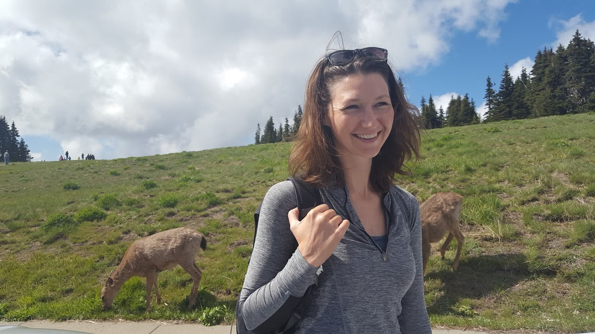
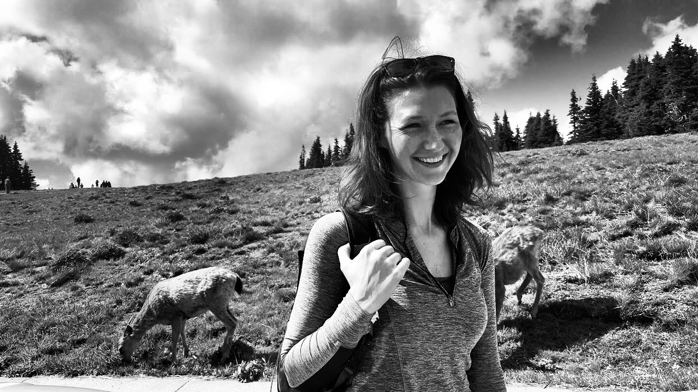
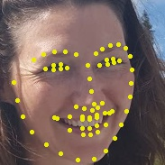
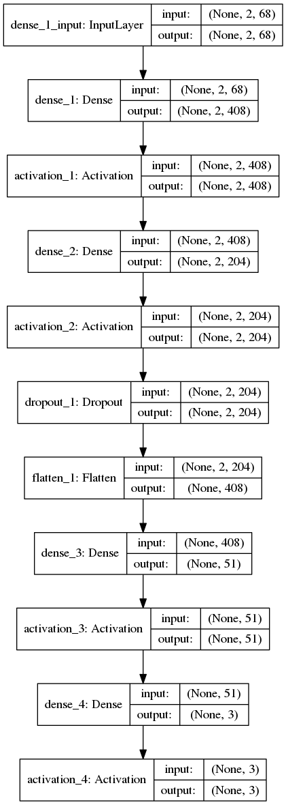

# Face2Vec
A fast and accurate method for facial recognition that can be trained an run on a laptop.
Uses computer vision pre-processing to extract facial landmark data from faces, and trains 


## Dependencies 
Tested in Python3 on Linux Mint 18.2, Mac OSX (boost installed via brew)
```
sudo apt liboost-all-dev
sudo pip install opencv-python
sudo pip install dlib
```


## Pre-Processing Pipeline
  Using the classical computer vision libraries OpenCV2 and Dlib, image are searched for faces. Any faces present are cropped out, and labled wit ha key point detector. These keypoints are stored in 2-dimensional array of size (2,68) representing the euclidian coordinates of each keypoint.




#### Clarity boosting:
   Images are greyscaled, and contrast boosted with histogram equalization. This technique will make images clearer by scaling the changes in brightness more evently accross the image.
   



  
#### Face detection & cropping
  Next the image is scanned for faces using a Haar Cascade classifier within the Viola-Jones detection algorithm. Developed in 2001, this was the first real-time face detection technique, and has the advantage of being much faster than convolutional neural networks of toady to the detriment of accuracy, versatility, and it's general ability to handle  . As articulated in a more recent paper (https://arxiv.org/pdf/1408.1656.pdf) on mathematical computer vision techniques: "in unconstrained scenes such as faces in a crowd", The Viola Jones fails to "perform well due to large pose variations, illumination variations, occlusions, expression variations, out-of-focus blur, and low image resolution." As the goal of this tutorial is to make a lightweight face recognition algorithm, a classifier that is able to recognize the presence of a face quickly in a moderate diversity of contexts will suffice.
  
 #### Facial landmark extraction
  The dlib face detector scans the cropped face images to recognize  for images using a more specialized classfier, which as described by the author "is made using the classic Histogram of Oriented Gradients (HOG) feature combined with a linear classifier, an image pyramid, and sliding window detection scheme." http://dlib.net/face_landmark_detection.py.html The HOG based detectors may not be as robust for finding high contrast features as Haar detectors, but they have the advantage of recognizing variations in shading. For this reason, they are implemented as part of dlib's facial keypoint identification.


But why use two face recognizers?? The Viola Jones recognizer is faster and more accurate at finding a face in a large image space. To find the landmarks, the HOG is mantatory, but using the Viola Jones method first and cropping to the face it finds allows for decreased processing time, because the slower HOG is only looking at a small area.



What is created by facial marks is a standarized 'face mask' of 68 points corresponding to points on each face, like eyebrows, top of the nose, etc. The keypoints are returned in an array or x,y coordinates. This will be the input tensor for the neural network, but first a bit of massaging must be done to ensure accuracy.

While it is definitely possible to throw all these numbers into a neural network, there are a few simple pitfalls:
* x,y coordinates by themselves are not exactly what makes a face, so much as the relationship between them. While the point of using deep learning is to get the computer to extract features for us, this project if nothing else is an exercise in feature engineeing. To give the machine a head start, the euclidian distance between the most central landmark (tip of the nose), and each point is the value we will pass to the net.
* Another issue with passing the raw landmark coordinates is that the input images can be of arbitrary size meaning the distances between landmark points can vary greatly between pictures. To be comparable between images, their coordinates require some normalization. I used `sklearn.MaxAbsScaler().fit_transform` to scale the range of values between -1 and 0.


``` 
[[ 0.66666667  0.36363636  0.06060606 -0.21212121 -0.46969697 -0.68181818
  -0.83333333 -0.93939394 -0.92424242 -0.78787879 -0.57575758 -0.34848485
  -0.12121212  0.12121212  0.34848485  0.57575758  0.8030303   0.74242424
   0.83333333  0.87878788  0.87878788  0.83333333  0.84848485  0.92424242
   0.98484848  1.          0.93939394  0.65151515  0.42424242  0.21212121
   0.         -0.04545455 -0.07575758 -0.10606061 -0.06060606  0.01515152
   0.59090909  0.65151515  0.66666667  0.60606061  0.59090909  0.57575758
   0.65151515  0.74242424  0.75757576  0.72727273  0.6969697   0.66666667
  -0.22727273 -0.21212121 -0.21212121 -0.22727273 -0.18181818 -0.15151515
  -0.12121212 -0.34848485 -0.46969697 -0.51515152 -0.51515152 -0.43939394
  -0.24242424 -0.25757576 -0.25757576 -0.22727273 -0.15151515 -0.36363636
  -0.40909091 -0.40909091]
 [ 1.          0.9673913   0.92391304  0.85869565  0.75        0.57608696
   0.40217391  0.19565217  0.         -0.14130435 -0.25       -0.32608696
  -0.39130435 -0.43478261 -0.44565217 -0.45652174 -0.43478261  0.72826087
   0.60869565  0.47826087  0.34782609  0.2173913  -0.02173913 -0.09782609
  -0.19565217 -0.29347826 -0.38043478  0.07608696  0.05434783  0.0326087
   0.          0.2173913   0.11956522  0.02173913 -0.04347826 -0.09782609
   0.58695652  0.48913043  0.40217391  0.32608696  0.40217391  0.48913043
  -0.06521739 -0.15217391 -0.22826087 -0.30434783 -0.23913043 -0.16304348
   0.47826087  0.29347826  0.14130435  0.05434783 -0.0326087  -0.13043478
  -0.2173913  -0.14130435 -0.04347826  0.04347826  0.13043478  0.29347826
   0.44565217  0.14130435  0.05434783 -0.0326087  -0.18478261 -0.0326087
   0.05434783  0.14130435]] 
```

#### This is not a face
  But it can represent one to the self-optimizing linear algebra machine we are about to toss it into! Through a bit of old school computer vision we have reduced the feature size dramatically. To quantify this, the size of input image in the example is 242.9 kB, and by using `numpy.nbytes` on the output array we can see that the array we are now dealing with is down to 1088 bytes. In this instance, size of the input to our neural network classifier is 0.44% the size of the original image, a 244x reduction! 


#### Cache preprocessed training data

  Next, each picture in the training folder is processed in this manner, and their landmark tensors stored in a pickle file for retrieval upon training. Labels are created by the text in the name of the image files.


What is created by facial marks is a standarized 'face mask' of 68 points corresponding to points on each face, like eyebrows, top of the nose, etc. The keypoints are stored in an array associated with a face label. This is the input tensor for the neural network.

#### Cache preprocessed training data
  All data in training folders are processed and their landmark tensors stored in a pickle file for retrieval upon training.


  
## Neural network

  Now time for the deep learning. Using Keras with a Tensorflow backend, I built a fully connected net with several layers.  There was a decent amount of hand tuning involved, and I settled for the following configuration, with L2 bias and weight regularization at each fully connected node. I'm sure this could use more fine tuning, at some point I'd like to do a grid search or other type of hyperparameter optimization.

  

  To ensure traning accuracy I built a simple k-fold cross validation trainer. I found that an `nadam` optimizer worked best. To help visualize training I built in some callbacks for tensorboard.
  
## Features of neural network:
  * `get_accuracy()` will run each image in the `./faces` directory through the net and return it's overall accuracy. With the provided data, there is 100% accuacy and takes less than one second per image.
  * `run_kfold()` trains on samples in the folder, using k-fold cross validation. You can re run this as many times as you want and watch the progress in tensorboard. Additional tranings by default will add to the current weights, so to start over remove `weights.best.hdf5`.
  `predict(image_path)` will make a prediction on a singular image.
  This repo comes with a pretrained model and pictures to test (1.6MB)

  


## Caveats

## Shout outs


